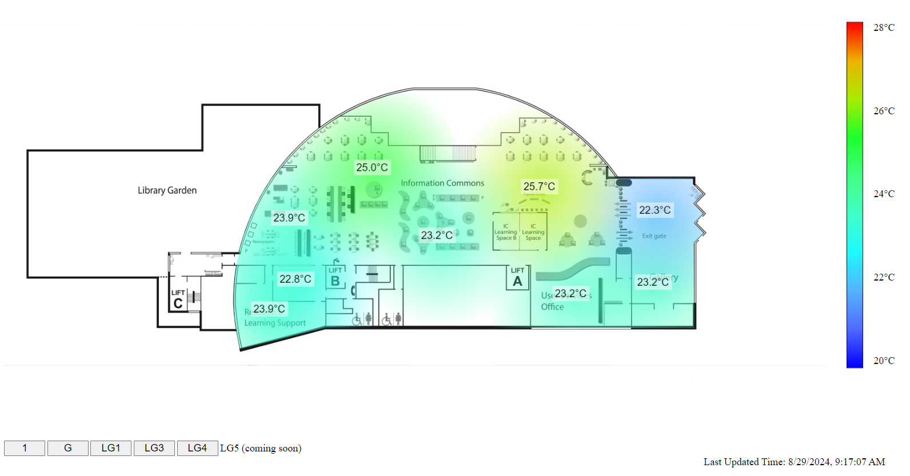

_HKUST Library - DS CoLab Project - S001_

# Temperature Heatmap on Library Floor Plan

**Project Introduction:** https://library.hkust.edu.hk/ds/project/s001/
**Timeframe:** 2023/24 Summer semester (Jul-Aug 2024)

## Preview



## Run our tool on your computer locally

1. **Ensure php 8.1 is installed in your computer.**

2. **Download our source code.**

    ```
    git clone https://github.com/hkust-lib-ds/S001-PUBLIC_LibFloorPlan-Temperature-Vis
    ```

3. **Update \<API URL\> in heatmap-data.js and \<API Key\> in api/api.php for the API connection.**

## Project Team

| Developer             | Details                                    |
| :-------------------- | :----------------------------------------- |
| LOU Cheuk Yin, Jessie | Year 3, BSc in Data Science and Technology |

| Adviser   | Details                                |
| :-------- | :------------------------------------- |
| Terry YIP | Librarian (Systems & Digital Services) |
